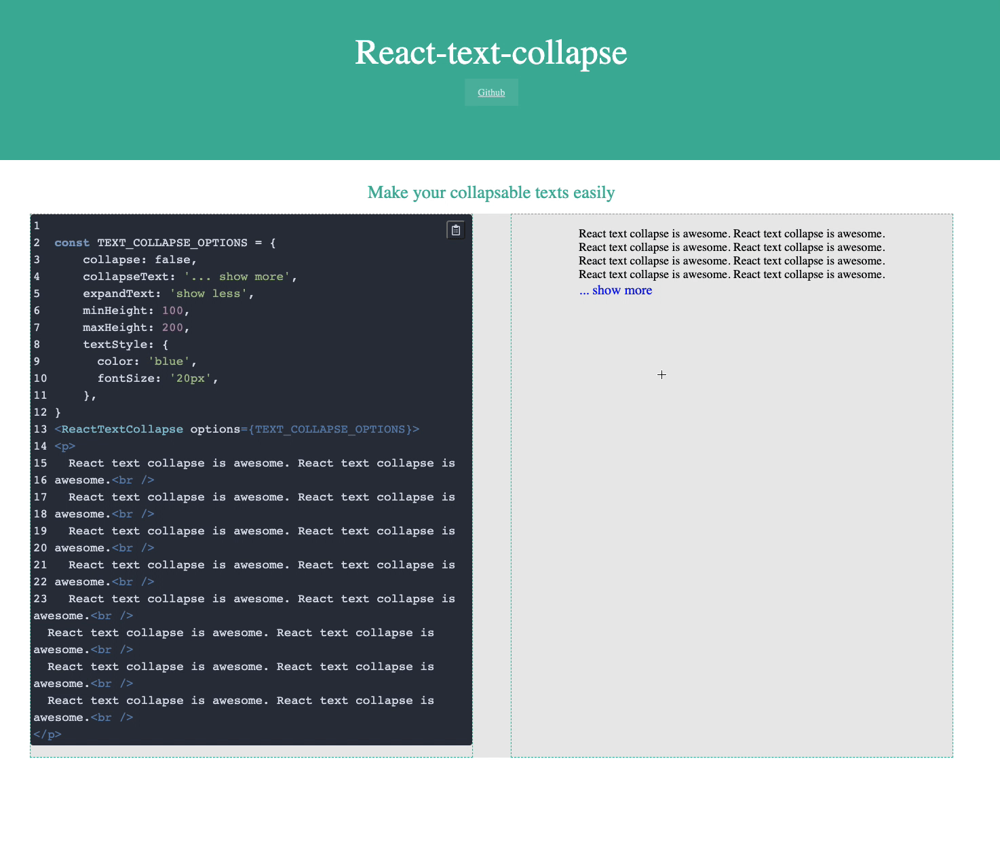

<big><h1 align="center">React text collapse</h1></big>

<p align="center">
  <a href="https://www.npmjs.com/package/react-text-collapse">
    
  </a>

 <a href="https://coveralls.io/github/cht8687/react-text-collapse?branch=master">
    
 </a>

  <a href="https://travis-ci.org/cht8687/react-text-collapse">
    
  </a>

  <a href="https://npmjs.org/package/react-text-collapse">
    
  </a>

  <a href="https://david-dm.org/cht8687/react-text-collapse.svg">
    
  </a>

  <a href="https://github.com/cht8687/react-text-collapse/blob/master/LICENSE">
    
  </a>
</p>

<p align="center"><big>

</big></p>



## Philosophy

> Keep things simple! You don't need jQuery...

## Installation

[](https://gitter.im/cht8687/react-text-collapse?utm_source=badge&utm_medium=badge&utm_campaign=pr-badge&utm_content=badge)

### npm

```
$ npm install --save react-text-collapse
```

## Demo

[Demo](http://cht8687.github.io/react-text-collapse/example/)

## Example code

[Code Example](https://github.com/cht8687/react-text-collapse/blob/master/src/example/example.js)

## Usage

```js
<ReactTextCollapse options={TEXT_COLLAPSE_OPTIONS}>
  <p>
    React text collapse is awesome. React text collapse is awesome.<br />
    React text collapse is awesome. React text collapse is awesome.<br />
    React text collapse is awesome. React text collapse is awesome.<br />
    React text collapse is awesome. React text collapse is awesome.<br />
  </p>
</ReactTextCollapse>
```

## Options

#### `options`: PropTypes.object.isRequired

```js
const TEXT_COLLAPSE_OPTIONS = {
  collapse: false, // default state when component rendered
  collapseText: '... show more', // text to show when collapsed
  expandText: 'show less', // text to show when expanded
  minHeight: 100, // component height when closed
  maxHeight: 250 // expanded to
  textStyle: { // pass the css for the collapseText and expandText here
    color: "blue",
    fontSize: "20px"
  }
}
```

## Development

```
$ git clone git@github.com:cht8687/react-text-collapse.git
$ cd react-text-collapse
$ npm install
$ webpack-dev-server
```

Then

```
open http://localhost:8080/webpack-dev-server/
```

## License

MIT

[](https://github.com/feross/standard)
